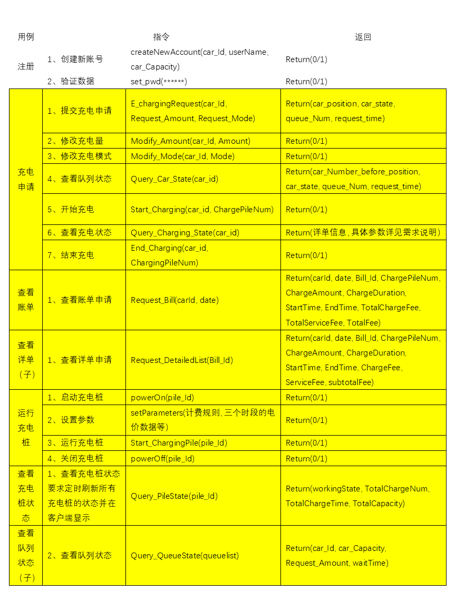

# 软件工程大作业 6.15验收

      

## 作业一

1. 充电站分为“充电区”和“等候区”两个区域。电动车到达充电站后首先进入等候区，通过客户端软件向服务器提交充电请求。服务器根据请求充电模式的不同为客户分配两种类型排队号码：如果是请求“快充”模式，则号码首字母为F，后续为F类型排队顺序号（从1开始，如F1、F2）；如果是请求“慢充”模式，则号码首字母为T，后续为T类型排队顺序号（从1开始，如T1、T2）。此后，电动车在等候区等待叫号进入充电区。等候区最大车位容量为6。

2. 充电区安装有2个快充电桩（A、B）和3个慢充电桩（C、D、E），快充功率为30度/小时，慢充功率为7度/小时。每个充电桩设置有等长的排队队列，长度为2个车位（只有第一个车位可充电）。当任意充电桩队列存在空位时，系统开始叫号，按照排队顺序号“先来先到”的方式，选取等候区与该充电桩模式匹配的一辆车进入充电区（即快充电桩对应F类型号码，慢充电桩对应T类型号码），并按照调度策略加入到匹配充电桩的排队队列中。

3. 系统调度策略为：对应匹配充电模式下（快充/慢充），被调度车辆完成充电所需时长（等待时间+自己充电时间）最短。（等待时间=选定充电桩队列中所有车辆完成充电时间之和；自己充电时间=请求充电量/充电桩功率）
例：如图1所示，快充电桩按照F1→F2先来先到的顺序进行叫号；慢充电桩按照T1→T2→T3→T4先来先到的顺序进行叫号。当F1被调度时，由于快充电桩A、B均有空位，它可以分派到这两个队列；同样当T1被调度时，它可以分派到慢充电桩D、E两个队列。它们最终被分配到哪个队列需要按照调度策略，即F1完成充电所需时长（等待时间+自己充电时间）最短，以及T1完成充电所需时长（等待时间+自己充电时间）最短。

4. 计费规则：

    a) 总费用=充电费+服务费，充电费=单位电价*充电度数，服务费=服务费单价*充电度数。

    b) 单位电价：随时间变化分为三类，峰时（1.0元/度，10:00 - 15:00，18:00 - 21:00）、平时（0.7元/度，7:00 - 10:00，15:00 - 18:00，21:00 - 23:00）、谷时（0.4元/度，23:00 - 次日7:00）。

    c) 服务费单价：0.8元/度

    d) 充电时长（小时）=实际充电度数/充电功率（度/小时）

5. 系统由服务器端、用户客户端、管理员客户端组成。其中：

    a) 服务器端需要具备的功能包括：用户信息维护；车辆排队号码生成；调度策略生成；计费；充电桩监控；数据统计（详单、报表数据生成）。

    b) 用户客户端需要具备的功能包括：注册、登录；查看充电详单信息，至少包含如下字段：详单编号、详单生成时间、充电桩编号、充电电量、充电时长、启动时间、停止时间、充电费用、服务费用、总费用；提交或修改充电请求，包括充电模式（快充/慢充）、本次请求充电量；查看本车排队号码；查看本充电模式下前车等待数量；结束充电。

    c) 管理员客户端需要具备的功能包括：启动/关闭充电桩；查看所有充电桩状态（各充电桩的当前状态信息（是否正常工作、系统启动后累计充电次数、充电总时长、充电总电量））；查看各充电桩等候服务的车辆信息（用户ID、车辆电池总容量（度）、请求充电量（度）、排队时长）；报表展示，至少包含如下字段：时间（日、周、月）、充电桩编号、累计充电次数、累计充电时长、累计充电量、累计充电费用、累计服务费用、累计场景总费用。

6. 用户修改请求场景。系统允许用户在特殊状态下修改充电请求，场景如下：

    a) 修改充电模式（快/慢充）

        i. 允许在等候区修改，修改后重新生成排队号，并排到修改后对应模式类型队列的最后一位。

        ii. 不允许在充电区修改，可取消充电重新进入等候区排队。

    b) 修改请求充电量

        i. 允许在等候区修改，排队号不变

        ii. 不允许在充电区修改，可取消充电离开或重新进入等候区排队

    c) 取消充电：等候区、充电区均允许

7、若充电桩出现故障（只考虑单一充电桩故障且正好该充电桩有车排队的情况），则正在被充电的车辆停止计费，本次充电过程对应一条详单。此后系统重新为故障队列中的车辆进行调度。

    a) 优先级调度：暂停等候区叫号服务，当其它同类型充电桩队列有空位时，优先为故障充电桩等候队列提供调度，待该故障队列中全部车辆调度完毕后，再重新开启等候区叫号服务。

    b) 时间顺序调度：暂停等候区叫号服务，将其它同类型充电桩中尚未充电的车辆与故障候队列中车辆合为一组，按照排队号码先后顺序重新调度。调度完毕后，再重新开启等候区叫号服务。

    c) 当充电桩故障恢复，若其它同类型充电桩中尚有车辆排队，
    则暂停等候区叫号服务，将其它同类型充电桩中尚未充电的车辆合为一组，按照排队号码先后顺序重新调度。调度完毕后，再重新开启等候区叫号服务。

8. 扩展调度请求（选做，可加分）

a) 单次调度总充电时长最短：当充电区某种模式的充电桩出现M个空位时，系统可在等候区该模式对应的队列中，按照编号顺序一次性叫N个号（N<=M），此时进入充电区的多辆车不再按照编号顺序依次调度，而是“统一调度”，策略为：

(1)按充电模式分配对应充电桩；

(2)满足进入充电区的多辆车完成充电总时长（所有车累计等待时间+累计充电时间）最短。

例：快充电桩A、B出现2个空位，等候区有F1、F2两辆快充车，因此可以将F1、F2一次性叫号进入充电区。进入充电区后，F1、F2不再按照编号顺序依次调度，而是统一进行考虑。此时，F1、F2有两种方式被分配到A、B两个空位中，如何分配由调度策略决定，即满足两辆车完成充电总时长（所有车累计等待时间+累计充电时间）最短。同理，慢充电桩D、E出现3个空位，等候区有T1 - T4四辆慢充车，因此可以按照编号顺序将T1、T2、T3一次性叫号进入充电区。进入充电区后，T1、T2、T3不再按照编号顺序依次调度，而是统一进行考虑。此时，T1、T2、T3有多种方式被分配到D、E两个队列的三个空位中，如何分配由调度策略决定，即满足三辆车完成充电总时长（所有车累计等待时间+累计充电时间）最短。

b) 批量调度总充电时长最短：为了提高效率，假设只有当到达充电站的车辆等于充电区全部车位数量时，才开始进行一次批量调度充电，完成之后再进行下一批。规定进入充电区的一批车不再按照编号顺序依次调度，而是“统一调度”，系统调度策略为：(1)忽略每辆车的请求充电模式，所有车辆均可分配任意类型充电桩；(2)满足一批车辆完成充电总时长（所有车累计等待时间+累计充电时间）最短。
例：如图1所示，充电区总共有10个车位，当到达充电站的车辆不少于10辆时才能进行一次批量调度，此时按照编号顺序一次性叫号10辆车同时进入充电区。进入充电区后，10辆车不再按照编号顺序依次调度，而是统一进行分配。对于每辆车不考虑其充电模式，可分配任意类型充电桩，如何将10辆车分配到对应的车位由调度策略决定，即满足10辆车完成充电总时长（所有车累计等待时间+累计充电时间）最短。

c) 以上两种调度方式均不考虑客户修改充电请求以及充电桩出现故障等特殊情况。
注：需求描述中所涉及的参数：快充电桩数（FastChargingPileNum）、慢充电桩数（TrickleChargingPileNum）、等候区车位容量（WaitingAreaSize）、充电桩排队队列长度（ChargingQueueLen），在系统验收测试时可自由设置。

## 作业二

1. 调度

本次作业要求完成下列用例对应的系统事件的动态结构设计以及用例级别的静态结构的设计，除此之外要求**组长**完成在充电过程中出现一个充电桩故障的情况下，调度对象进行调度的交互过程：

- 优先级调度；
- 时间顺序调度；
- 充电中故障恢复；

2. 调度策略设计：

- 单次调度总充电时长最短；
- 批量调度总充电时长最短。

对这两个调度策略进行设计，要求交互图中能够清晰展示需求说明中的条件以及逻辑关系。

